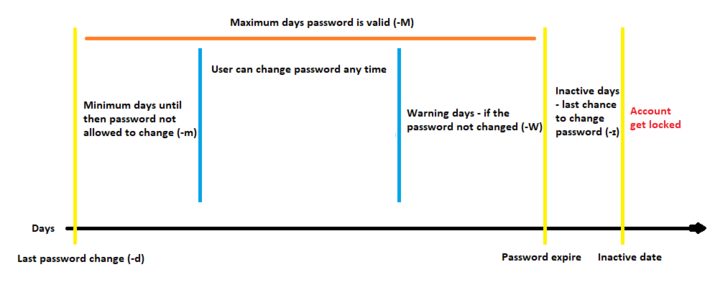

# Simulacro del examen RHCSA 

Realiza la tarea expuesta en cada apartado y haz clic en "Mostrar comando" para ver un ejemplo de como realizar la tarea solicitada correctamente.

## Índice

1. [IPv6](#id1)
2. [Gestion y administración de interfaces de red](#id2)
3. [Redhat Subscription manager](#id3)
4. [Gestor de paquetes yum](#id4)
5. [Control de servicios con systemctl](#id5)
6. [Reestablecer la password del usuario root](#id6)
7. [Gestion de discos](#id7)
8. [Stratis](#id8)
9. [VDO](#id9)
10. [NFS](#id10)
11. [Comando timedatectl](#id11)
12. [chronyd](#id12)
13. [Journal del sistema ](#id13)
14. [Gestionando la seguridad del sistema con SELinux](#id14)
15. [Administración y gestión del Firewall, con firewall-cmd](#id15)
16. [Uso de SUDO](#id16)
17. [Gestion de Usuarios y grupos](#id17)
18. [Permisos especiales](#id18)
19. [Gestion y administracion de procesos](#id19)
20. [Perfiles de sintonización (tune profile)](#id20)
21. [Ficheros y directorios temporales](#id21)
22. [Containers con Podman](#id22)

## 1. IPv6

1. Hacer ping a IPv6 
    

      
Mostrar comando

      <pre>ping6 -c5 fe80::5054:ff:fe57:b57d%enp1s0</pre>
    

## 2. Gestion y administración de interfaces de red

1. Agregar una conexion secundaria con ip 192.168.100.191/24 y gateway 192.168.100.1
    

      
Mostrar comando

      <pre>
      nmcli connection add con-name second type ethernet ifname enp1s0 ip4 192.168.100.191/24 gw4 192.168.100.1
      </pre>
    

2. Modificar una conexion agregandole el dns 8.8.8.8
    

      
Mostrar comando

      <pre>
      nmcli conn mod second +ipv4.dns 8.8.8.8
      </pre>
    

3.  Establecer una interfaz en modo autoconnect
    

      
Mostrar comando

      <pre>
      nmcli con mod second connection.autoconnect yes
      </pre>
    

4.  Editar una conexion en modo interactivo
    

      
Mostrar comando

      <pre>
      nmcli connection edit enp1s0
      </pre>
    

5. Mostrar los permisos del usuario
    

      
Mostrar comando

      <pre>
      nmcli general permissions
      </pre>
    

## 3. Redhat Subscription manager

1. Registrar el host en el servicio de administración de suscripciones
    

      
Mostrar comando

      <pre>
      subscription-manager register
      </pre>
    

2. Listar información de productos y suscripciones disponibles
    

      
Mostrar comando

      <pre>
      subscription-manager list --available
      </pre>
    

3. Adjuntar una subscripción especifica usando un pool ID
    

      
Mostrar comando

      <pre>
      subscription-manager attach --pool=$POOLID
      </pre>
    

4. Desregistrar el sistema
    

      
Mostrar comando

      <pre>
      subscription-manager unregister
      </pre>
    

5. Mostrar repositorios que el sistema tiene derecho a usar
    

      
Mostrar comando

      <pre>
      subscription-manager repos --list-enabled
      </pre>
    

## 4. Gestor de paquetes yum

1. Listar el paquete httpd
    

      
Mostrar comando

      <pre>
      yum list 'httpd'
      </pre>
    

2. Buscar el paquete 'nginx'
    

      
Mostrar comando

      <pre>
      yum search 'nginx'
      yum search all 'nginx'
      </pre>
    

3. Ver informacion de un paquete de 'nginx'
    

      
Mostrar comando

      <pre>
      yum info 'nginx-all-modules'
      </pre>
    

4. Listar los grupos de paquetes
    

      
Mostrar comando

      <pre>
      yum group list
      yum group list hidden
      </pre>
    

5. Ver historial de yum
    

      
Mostrar comando

      <pre>
      yum history
      </pre>
    

6. Ver información de una instalacion/actualizacion usando el ID obtenido en el historial
    

      
Mostrar comando

      <pre>
      yum history info 10
      </pre>
    

7. Deshacer una instalacion usando el ID obtenido en el historial
    

      
Mostrar comando

      <pre>
      yum history undo 10
      </pre>
    

8. Indicar el fichero de configuración de yum
    

      
Mostrar comando

      <pre>
      /etc/yum.conf
      </pre>
    

9. Realizar la configuracion basica de un repositorio
    

      
Mostrar comando

      <pre>
      # Se crea un fichero en /etc/yum.repos.d/
      vi /etc/yum.repos.d/basic.repo
      # Se agrega el siguiente contenido
      [nombre-repo]  
      name = nombre repo  
      baseurl = https://fakewebsite.com/repositories/nombre-repo  
      enabled = 1  
      gpgcheck = 0  
      gpgkey = file://etc/pki/rpm-gpg/el-nombre-de-la-key  
      </pre>
    

10. Limpiar cache de repositorios de yum y visualizar los repositorios existentes
    

      
Mostrar comando

      <pre>
      yum clean all
      yum repolist
      </pre>
    

11. Importar llave GPG de un repositorio
    

      
Mostrar comando

      <pre>
      rpm --import https://fakewebsite.com/repositories/gpg-key
      # Se importa la key a /etc/pki/rpm-gpg
      </pre>
    

### 4.1 Modulos yum

1. Listar modulos
    

      
Mostrar comando

      <pre>
      yum module list
      </pre>
    

2. Instalar un modulo especifico
    

      
Mostrar comando

      <pre>
      yum module install module_name:version
      </pre>
    

## 5. Control de servicios con systemctl

1. Ver el contenido de un unit-file
    

      
Mostrar comando

      <pre>
      systemctl cat sshd.service
      </pre>
    

2. Ver todas las unidades tipo service en fallo
    

      
Mostrar comando

      <pre>
      systemctl --failed -t service --all
      </pre>
    

3. Enmascarar un servicio (desactivarlo completamente)
    

      
Mostrar comando

      <pre>
      systemctl mask --now firewalld
      </pre>
    

4. Desenmascarar un servicio
    

      
Mostrar comando

      <pre>
      systemctl unmask firewalld
      </pre>
    

5. Cambiar el target del sistema a modo consola
    

      
Mostrar comando

      <pre>
      systemctl isolate multi-user.target  
      </pre>
    

6. Cambiar el target del sistema a modo grafico
    

      
Mostrar comando

      <pre>
      systemctl isolate graphical.target
      </pre>
    

7. Ver el target del sistema por defecto
    

      
Mostrar comando

      <pre>
      systemctl get-default
      </pre>
    

8. Establecer un target por defecto
    

      
Mostrar comando

      <pre>
      systemctl set-default multi-user
      </pre>
    

## 6. Reestablecer la password del usuario root

1. Reestablece la contraseña del usuario root a 'rhcsa' empezando el proceso desde el arranque
    

      
Mostrar comando

      <pre>
      Tras enceder el host, editar el grub presionando: 'e'  
      Añadir el parametro: rd.break al final de la linea que empieza con: linux
      Montar el sistema de archivos / en rw mode: mount -o rw,remount /sysroot  
      Enjaular /sysroot: chroot /sysroot  
      Cambiar la password de root a rhcsa: passwd root  
      Crear un archivo para indicar a selinux que haga un retiquetado: touch /.autorelabel  
      Reiniciar: reboot 
      </pre>
    

## 7. Gestion de discos

1. Ver los puntos de montaje con sus filesystems y paths
    

      
Mostrar comando

      <pre>
      lsblk -fp
      </pre>
    

2. Listar los comandos de creacion de particiones y formateo de discos
    

      
Mostrar comando

      <pre>
      fdisk
      gdisk
      parted
      </pre>
    

3. Indicar el fichero del sistema donde se configuran los puntos de montaje y los tipos de formatos admitidos
    

      
Mostrar comando

      <pre>
      /etc/fstab  

      Ejemplos de formatos en fstab:  
      1. UUID=${UID} /mnt1 xfs defautls 0 0
      2. LABEL=${LABEL}  /mnt2 xfs defautls 0 0
      3. /dev/mapper/${VG}${LV} /mnt3 xfs defautls 0 0
      4. /dev/sda  /mnt4 xfs defautls 0 0

      </pre>
    

4. Crear una nueva swap de 500MB y activarla
    

      
Mostrar comando

      <pre>
      #Crear particion para swap
      fdisk /dev/vdb
      Nueva particion: n
      Tipo de particion primaria: p
      Numero de particion: 1
      Primer sector: predeterminado
      Ultimo sector: +500M
      Indicar tipo de sistema de archivos: t
      Tipo Linux Swap: 82
      Guardar cambios: w
      
      #Formatear como swap  
      mkswap /dev/vdb1
      
      #Montar swap  
      swapon /dev/vdb1

      #Crear entrada en fstab
      echo "/dev/vdb1 none swap defaults 0 0" >> /etc/fstab
      </pre>
    

5. Establecer prioridad 10 a la nueva swap y 5 a la antigua
    

      
Mostrar comando

      <pre>
      vi/etc/fstab  
      #Entre mayor sea el numero, mayor prioridad  
      /dev/mapper/rhel_rhcsa--master-swap none    swap    pri=5        0 0
      /dev/vdb1                           none    swap    pri=10       0 0
      </pre>
    

6. Visualizar los discos SWAP y comprobar que la prioridad establecidad en el punto anterior esta aplicada
    

      
Mostrar comando

      <pre>
      swapon --show
      </pre>
    

### 7.1. LVM: LV y VG 

1. Crear disco para usar como lvm con parted
    

      
Mostrar comando

      <pre>
      parted /dev/vdb mklabel msdos  
      parted /dev/vdb mkpart primary 1M 500M  
      parted /dev/vdb print  
      parted /dev/vdb set 1 lvm on  
      </pre>
    

2. Crear disco para usar como lvm con fdisk
    

      
Mostrar comando

      <pre>
      fdisk /dev/vdb  
      n  
      p  
      inicio: predeterminado  
      fin: +500M  
      t  
      8e  
      w
      </pre>
    

3. ¿Que son los Physical Extend (PE)?
    

      
Mostrar respuesta

      <pre>
      Es la cantidad de veces en la que se divide un Volume Group. ESta información se puede ver al ejecutar el comando vgdisplay  
      PE Size               4,00 MiB  
      Total PE              242  
      Alloc PE / Size       0 / 0   
      Free  PE / Size       242 / 968,00 MiB  
      </pre>
    

4. Crear un lvm indicando MB o PE (Extents)
    

      
Mostrar comando

      <pre>
      lvcreate volumegroupname -n logicalvolumename -L 250M  
      lvcreate volumegroupname -n logicalvolumename --extents 10  

      si cada physical extent es de 4mb, entonces 10*4, el lvm será de 40M  
      </pre>
    

5. Extender un volumen group
    

      
Mostrar comando

      <pre>
      vgextend vg01 /dev/sdc  
      </pre>
    

6. Extender un logical volume indicando megabytes
    

      
Mostrar comando

      <pre>
      lvextend /dev/vg01/lv02 -L +100M --resizefs --test  
      lvextend /dev/vg01/lv02 -L +100M --resizefs 
      </pre>
    

7. Extender un logical volume indicando extends
    

      
Mostrar comando

      <pre>
      lvextend /dev/vg01/lv02 --extents +25 --resizefs --test   
      lvextend /dev/vg01/lv02 --extents +25 --resizefs
      </pre>
    

8. Extender un logical volume indicando espacio libre
    

      
Mostrar comando

      <pre>
      lvextend /dev/vg01/lv02 -l +10%FREE --resizefs --test  
      lvextend /dev/vg01/lv02 -l +10%FREE --resizefs
      </pre>
    

 
9. Eliminar un physical volume de un volume group
    

      
Mostrar comando

      <pre>
      pvmove /dev/vbd1  
      vgreduce vg01 /dev/vbd1  
      pvremove /dev/vbd1  
      </pre>
    

10. Reducir un logical volume
    

      
Mostrar comando

      <pre>
      lvreduce /dev/vg01/lv01 -L 150M --resizefs --test  
      lvreduce /dev/vg01/lv01 -L 150M --resizefs
      </pre>
    

## 8. Stratis

1. Crear un pool y listar los pools
    

      
Mostrar comando

      <pre>
      stratis pool create labpool1 /dev/vdb /dev/vdc  
      stratis pool list  
      </pre>
    

2. Crear filesystem y listar los filesystems
    

      
Mostrar comando

      <pre>
      stratis filesystem create labpool1 fs1  
      stratis filesystem list  
      </pre>
    

## 9. VDO

1. Crear volumen
    

      
Mostrar comando

      <pre>
      vdo create --name volume-vdo1 --device /dev/sda --vdoLogicalSize 20G  
      </pre>
    

2. Ver volumenes y su estado
    

      
Mostrar comando

      <pre>
      vdo list  
      vdo status  
      </pre>
    

3. Formatear y montar volumen vdo
    

      
Mostrar comando

      <pre>
      mkfs.xfs /dev/mapper/volumen-vdo1  
      lsblk --output=UUID /dev/mapper/volume-vdo1  
      echo "UUID=bde4ea16-8f5c-42da-b45d-c1964cae89b2 /devxfs defaults,x-systemd.requires=vdo.service 0 0" >> /etc/fstab
      </pre>
    

4. Ver estado de un vdo
    

      
Mostrar comando

      <pre>
      vdostats --human-readable
      </pre>
    

## 10. NFS

1. Establecer configuraciones de NFS con nfsconf
    

      
Mostrar comando

      <pre>
      nfsconf --set nfsd vers2 y  
      nfsconf --set nfsd vers3 n  
      nfsconf --unset nfsd vers2  
      nfsconf --set nfsd vers2 n  
      </pre>
    

2. Ver recursos compartidos en un servidor
    

      
Mostrar comando

      <pre>
      showmount -e rhcsa-master.labrhel.com  
      </pre>
    

3. Automatizar montaje nfs - indirecto
    

      
Mostrar comando

      <pre>
      yum install autofs  
      systemctl --now enable autofs  
      
      vi /etc/auto.master.d/public.autofs   
      /public /etc/directpublic.test  
      
      /etc/directpublic.test  
      nfs -rw,sync rhcsa-master.labrhel.com:/srv/nfs  
      </pre>
    

4. Metodo directo
    

      
Mostrar comando

      <pre>
      vi /etc/auto.master.d/public.autofs  
      /- /etc/indirectpublic.test  
      
      vi /etc/indirectpublic.test  
      /mnt/nfs -rw,sync rhcsa-master.labrhel.com:/srv  

      </pre>
    

## 11. Comando timedatectl

1. Listar y establecer timezone
    

      
Mostrar comando

      <pre>
      timedatectl list-timezones
      timedatectl set-timezone Africa/Ouagadougou
      </pre>
    

2. Ajustar hora
    

      
Mostrar comando

      <pre>
      timedatectl set-time 09:00:00
      </pre>
    

3. Activar ntp service
    

      
Mostrar comando

      <pre>
      timedatectl set-ntp true
      </pre>
    

## 12. chronyd

1. Ver estado de sync de chronyc
    

      
Mostrar comando

      <pre>
      chronyc tracking  
      chronyc sources -v  
      </pre>
    

2. Lanzar el wizard de seleccion timezone
    

      
Mostrar comando

      <pre>
      tzselect
      </pre>
    

## 13. Journal del sistema 

1. Indicar el fichero de configuración del Journal
    

      
Mostrar comando

      <pre>
      /etc/systemd/journal.conf
      </pre>
    

2. Ver warnings,criticals,etc... en el journal
    

      
Mostrar comando

      <pre>
      journalctl -p [emerg|alert|crit|err|warning|notice|info|debug]  
      Ejemplo: journalctl -u chronyd -p err  
      </pre>
    

3. ver errores por una fecha especifica 
    

      
Mostrar comando

      <pre>
      journalctl -p err --since "2022-01-31 09:00:00" --until "2022-01-31 09:30:00"
      </pre>
    

4. Filtros posibles al visualizar el journal
    

      
Mostrar comando

      <pre>
      journalctl _PID=1000  
      journalctl _UID=0  
      journalctl _COMM=command  
      journalctl _EXE=ejecutablepath  
      journalctl _SYSTEMD_UNIT=sshd.service  

      </pre>
    

5. Guardar un mensaje indicado prioridad 
    

      
Mostrar comando

      <pre>
      logger -p local7.error "Esto es un error del copon"
      </pre>
    

## 14. Gestionando la seguridad del sistema con SELinux

1. Ver contextos de seguridad
    

      
Mostrar comando

      <pre>
      semanage fcontext -l
      </pre>
    

2. Ver el contexto de seguridad de los ficheros:  
    

      
Mostrar comando

      <pre>
      ls -lZ  
      se muestra:  
      unconfined_u:object_r:httpd_sys_content_t:s0  
      user:role:??:label  
      </pre>
    

3. Cambiar modo de funcionamiento de selinux
    

      
Mostrar comando

      <pre>
      setenforce [0|1]  
      vi /etc/selinux/config  
      </pre>
    

4. Restaura contexto de seguridad selinux en directorio
    

      
Mostrar comando

      <pre>
      restorecon -v /directorio
      </pre>
    

5. Aplicar un contexto de seguridad especifico
    

      
Mostrar comando

      <pre>
      chcon -t httpd_sys_content_t /directorio
      </pre>
    

6. Visualizar los Booleans de selinux
    

      
Mostrar comando

      <pre>
      getsebool -a 
      </pre>
    

7. Ver más detallada información de los boolean
    

      
Mostrar comando

      <pre>
      semanage boolean -l
      </pre>
    

8. Activar o desactivar un boolean (reglas) temporal
    

      
Mostrar comando

      <pre>
      setbool -P abrt_anon_write on
      </pre>
    

9. Activar o desactivar un boolean definitivo
    

      
Mostrar comando

      <pre>
      setsebool -P abrt_anon_write on .
      </pre>
    

10. Mantener cambios de contextos de seguridad tras relabel de selinux
    

      
Mostrar comando

      <pre>
      semanage fcontext -a -t httpd_sys_content_t /directorio
      </pre>
    

11. Ver errores de selinux
    

      
Mostrar comando

      <pre>
      sealert -a /var/log/audit/audit.log  
      ausearch -m AVC -ts recent
      </pre>
    

12. Ver puertos en SELinux
    

      
Mostrar comando

      <pre>
      semanage port -l
      </pre>
    

13. Agregar un puerto en selinux para Apache
    

      
Mostrar comando

      <pre>
      semanage port -a -t http_port_t -p tcp 1009
      </pre>
    

## 15. Administración y gestión del Firewall, con firewall-cmd

1. Agregar un servicio permanentemente
    

      
Mostrar comando

      <pre>
      firewall-cmd --permanent --add-service=https  
      </pre>
    

2. Eliminar un servicio permanentemente
    

      
Mostrar comando

      <pre>
      firewall-cmd --permanent --remove-service=https  
      </pre>
    

3. Agregar un puerto permanentemente
    

      
Mostrar comando

      <pre>
      firewall-cmd --permanent --add-port=1009/tcp  
      </pre>
    

4. Recargar la configuracion
    

      
Mostrar comando

      <pre>
      firewall-cmd --reload  
      </pre>
    

## 16. Uso de SUDO

1. Configurar un usuario para que no se le pida contraseña
    

      
Mostrar comando

      <pre>
      cd /etc/sudoers.d/  
      echo "david ALL=(ALL) NOPASSWD: ALL" >> david_user  

      </pre>
    

2. Configurar un grupo para que tenga permisos sudo
    

      
Mostrar comando

      <pre>
      cd /etc/sudoers.d/  
      echo "%admins ALL=(ALL) ALL" >> admins_group  

      </pre>
    

## 17. Gestion de Usuarios y grupos

1. Comandos para gestionar usuarios y grupos
    

      
Mostrar comando

      <pre>
      usermod  
      useradd  
      gpasswd  
      groupadd  
      groupdel  
      </pre>
    

2. Explicación del comando chage  
    
    

      
Mostrar comando

      
      <pre>
      chage -m 2 -M 31 -W 2 -I 1 -E 2022-12-31 user
      </pre>
    

3. Bloquear una cuenta en fecha determinada
    

      
Mostrar comando

      <pre>
      usermod -L -e 2022-07-30 david  
      </pre>
    

## 18. Permisos especiales

1. Como agregar y quitar permisos setuid
    

      
Mostrar comando

      <pre>
      El permiso SetUID en un archivo provoca que cualquier usuario que ejecute el fichero obtenga los  permisos del propietario del fichero

      chmod u+s file.sh  
      chmod 4700 file.sh  

      chmod u-s file.sh  
      </pre>
    

2. Como agregar y quitar permisos setgid
    

      
Mostrar comando

      <pre>
      En un fichero es similar a SetUID, trabaja dando los permisos del grupo al usuario que ejecuta el archivo  

      En un directorio actúa estableciendo siempre el grupo del propietario como grupo para todos los ficheros/directorios que se creen dentro del mismo  

      chmod g+s file.sh  
      chmod 2700 file.sh  

      chmod g+s dir  
      chmod 2700 dir  

      chmod g-s [ dir | file.sh ]  

      </pre>
    

3. Como agregar y quitar permisos  sticky bit
    

      
Mostrar comando

      <pre>
      El sticky bit se utiliza en directorios compartidos, es decir, directorios en los que muchos usuarios pueden escribir, y como bien sabemos si un usuario puede escribir en un directorio también puede borrar aunque no sea propietario del archivo que borra.

      chmod o+t directorio  
      chmod 1700 directorio

      chmod o-t directorio  

      </pre>
    

## 19. Gestion y administracion de procesos

1. Matar la sesion de usuario
    

      
Mostrar comando

      <pre>
      pkill -t tty\3  
      pkill -SIGKILL -t pts/2

      </pre>
    

2. Arrancar un proceso con un valor nice especifico
    

      
Mostrar comando

      <pre>
      nice -n 15 process.sh
      </pre>
    

3. Modificar el valor nice actual de un proceso
    

      
Mostrar comando

      <pre>
      renice -n -10 132
      </pre>
    

## 20. Perfiles de sintonización (tune profile)

4. Instalar tuned
    

      
Mostrar comando

      <pre>
      Instalar tuned  
      </pre>
    

5. Comando de gestion de perfiles
    

      
Mostrar comando

      <pre>
      tune-adm
      </pre>
    

## 21. Ficheros y directorios temporales

1. Cuales son los directorios gestionados por systemd para ficheros temporales 
    

      
Mostrar comando

      <pre>
      /etc/tmpfiles.d   
      /usr/lib/tmpfiles.d  
      /run/tmpfiles.d  
      </pre>
    

2. Ver servicio el servicio de limpieza de ficheros temporales
    

      
Mostrar comando

      <pre>
      systemctl status systemd-tmpfiles-clean
      </pre>
    

3. Limpiar ficheros temporales con systemd-tmpfiles
    

      
Mostrar comando

      <pre>
      systemd-tmpfiles --clean
      </pre>
    

4. Crear directorios temporales
    

      
Mostrar comando

      <pre>
      systemd-tmpfiles --create
      </pre>
    

5. Ver configuracion actual de directorios temporales
    

      
Mostrar comando

      <pre>
      systemd-tmpfiles --cat-config
      </pre>
    

## 22. Containers con Podman

1. Instalar el grupo de paquetes para podman
    

      
Mostrar comando

      <pre>
      dnf install -y @container-tools
      </pre>
    

2. Buscar una imagen en el registry de redhat
    

      
Mostrar comando

      <pre>
      podman search registry.redhat.io/mariadb
      </pre>
    

3. Pullear un contenedor desde el registry de redhat
    

      
Mostrar comando

      <pre>
      podman login  registry.redhat.io
      podman pull registry.redhat.io/rhel8/mariadb-103

      </pre>
    

4. Ver imagenes locales
    

      
Mostrar comando

      <pre>
      podman images --all
      </pre>
    

5. Inspeccionar una imagen especifica
    

      
Mostrar comando

      <pre>
      podman inspect 364f5d5eb513
      </pre>
    

6. Lanzar un container como demonio, exponiendo un puerto concreto
    

      
Mostrar comando

      <pre>
      podman run -d -p 8081:80 --name http fc7e49a0cf98
      </pre>
    

##### Esta pagina no tiene relación alguna con Red Hat ©.
